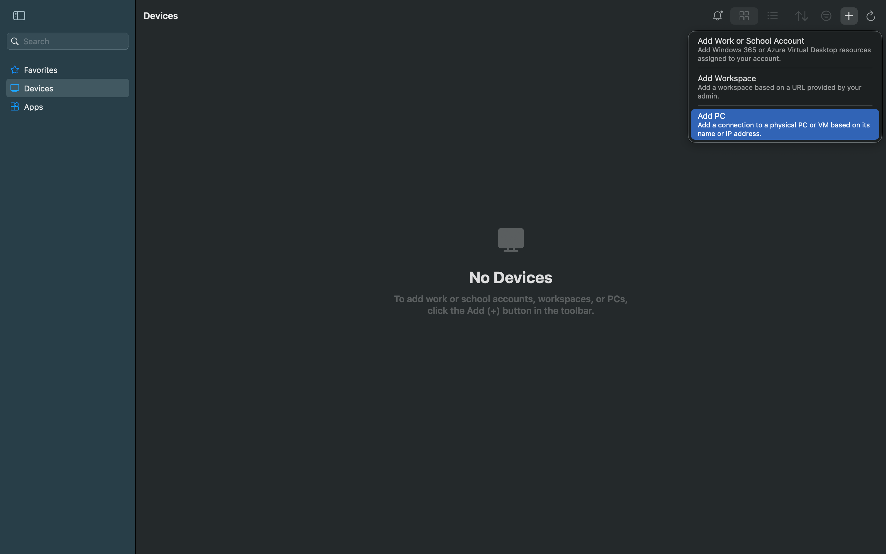
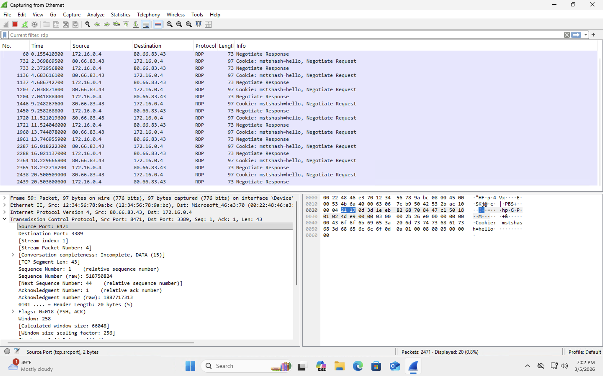
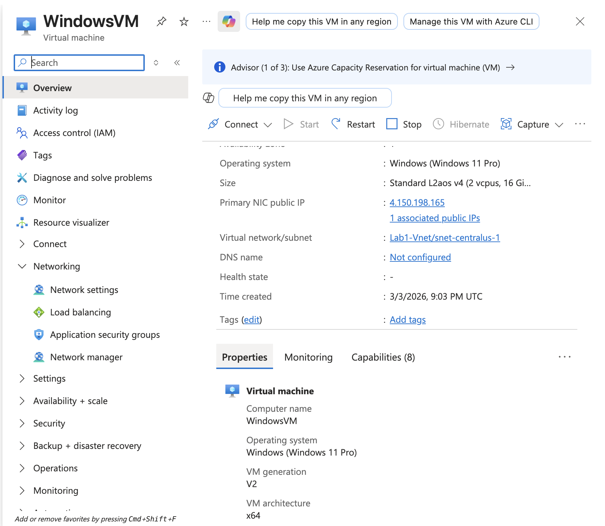
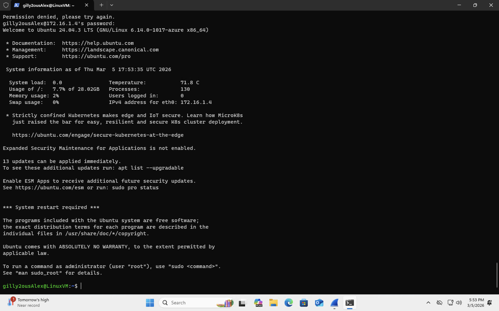
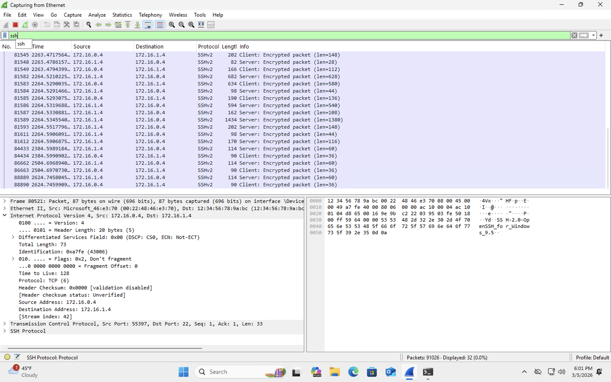
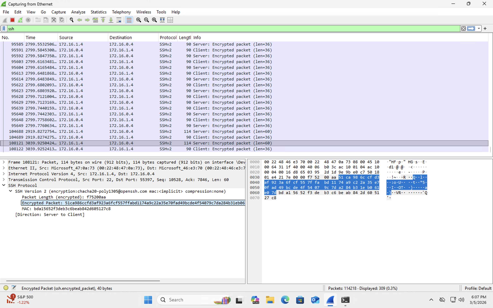
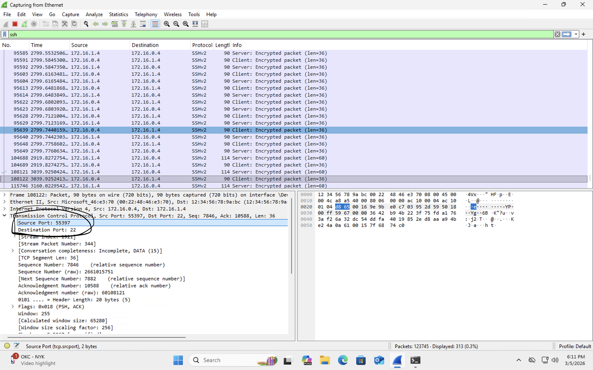

<h2>RDP Traffic Analysis</h2>

<h3>Understanding RDP</h3>

Before analyzing the packets in Wireshark, it is important to understand what <b>RDP (Remote Desktop Protocol)</b> is.

RDP is a proprietary protocol developed by Microsoft that allows a user to remotely connect to and control another computer over a network. Instead of physically sitting at the machine, a user can log into the system from another device and interact with its desktop environment as if they were locally present.

RDP is commonly used by system administrators to manage remote servers and by organizations to allow employees to access their work computers remotely.

RDP communication typically occurs over <b>TCP port 3389</b>. During a remote desktop session, keyboard input, mouse movements, screen updates, and other data are transmitted between the client and the remote machine.

Security analysts often monitor RDP traffic because exposed or misconfigured RDP services are a common entry point for attackers.

<h3>Establishing an RDP Connection</h3>

To generate RDP traffic in this lab, the Windows virtual machine was accessed remotely using Microsoft Remote Desktop.

First, the Remote Desktop client was opened and a new connection was created by selecting the option to add a new PC.

The public IP address of the Windows virtual machine was then entered to establish the remote connection.

Once the connection was initiated, the Remote Desktop client successfully connected to the Windows VM hosted in Microsoft Azure.

<h3>Observing RDP Traffic in Wireshark</h3>

While the remote session was active, Wireshark was used to capture and analyze the network traffic generated by the RDP connection.

To isolate RDP packets, the following display filter was applied:

<b>rdp</b>

After applying the filter, Wireshark displayed only packets related to the Remote Desktop Protocol.

The captured packets show communication occurring between the client system and the Windows virtual machine over TCP port 3389. These packets include negotiation messages that establish the remote session.

<h3>Inspecting Packet Details</h3>

Selecting an individual packet in Wireshark reveals detailed information about the communication taking place between the two systems.

The packet details pane shows the protocol layers involved in the transmission, including Ethernet, IP, and TCP, followed by the RDP protocol data.

This information allows analysts to inspect how the remote session is established and how data is transmitted between the client and the remote system.

Monitoring RDP traffic can help identify suspicious remote access attempts, detect brute force attacks, and troubleshoot connectivity issues in enterprise environments.

<h2>SSH Traffic Analysis</h2>

<h3>Understanding SSH</h3>

Before analyzing the packets in Wireshark, it is important to understand what <b>SSH (Secure Shell)</b> is.

SSH is a network protocol used to securely connect to another computer over a network. It allows a user to remotely access a machine, run commands, and manage files through an encrypted connection.

SSH is commonly used by system administrators and security professionals to securely manage Linux servers and other remote systems.

SSH communication typically uses <b>TCP port 22</b>. Unlike protocols that send information in plain text, SSH encrypts the traffic so that usernames, passwords, commands, and responses cannot be easily read by someone capturing packets on the network.

<h3>Connecting to the Linux Virtual Machine</h3>

To generate SSH traffic in this lab, the Windows virtual machine was used to connect to the Linux virtual machine over the private network. To establish the SSH connection, the private IP address of the Linux virtual machine was used. Since both virtual machines were on the same virtual network, the private IP allowed a secure internal connection between the systems without exposing the service to the public internet

Once the SSH connection was started, the Linux system requested authentication. After the correct password was entered, the connection was established successfully and the user was logged into the Ubuntu system.

When typing the password into the SSH session, the characters do <b>not</b> appear on the screen. This is normal behavior and is done for security reasons. Even though nothing is visible while typing, the password is still being entered.

<h3>Filtering SSH Traffic in Wireshark</h3>

To focus only on SSH traffic in Wireshark, the following display filter was applied:

<b>ssh</b>

After applying the filter, Wireshark displays packets related only to the SSH session between the Windows virtual machine and the Linux virtual machine.

The capture shows traffic labeled <b>SSHv2</b>, which indicates Secure Shell version 2 is being used for the connection.

<h3>Encrypted SSH Communication</h3>

One of the most important things to notice about SSH traffic is that the data is encrypted.

Unlike protocols such as ICMP or some unencrypted traffic where more readable information may appear, SSH protects the session contents. Wireshark can still capture the packets, but the actual information being exchanged is shown as <b>Encrypted packet</b>.

This is what makes SSH secure for remote logins and command execution.

<h3>Inspecting SSH Packet Details</h3>

Looking more closely at the packet details shows the transport information used for the SSH connection.

In this example, the packet details show that the traffic is being sent to <b>destination port 22</b>, which is the default port used by SSH. Wireshark is able to capture packets generated by each keystroke while interacting with the SSH shell. However, because SSH encrypts the session, the actual characters typed cannot be seen in the packet data

This confirms that the captured traffic is part of the secure shell session between the two machines.

<h3>Key Takeaway</h3>

SSH allows secure remote access by encrypting communication between systems.

Even though Wireshark can capture the packets involved in the session, the actual contents remain protected. This demonstrates why SSH is a trusted protocol for securely managing remote Linux systems.

